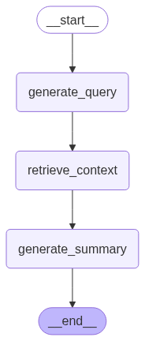

# 📄 AI-Powered PDF Topic Summarizer (LangGraph + Mistral + Chroma)

This project is an **AI document summarizer and topic-based query system** that uses a conversational RAG (Retrieval-Augmented Generation) workflow. Upload a PDF, ask topic-specific questions, and get concise, grounded summaries powered by Mistral and LangGraph.

---

## 🚀 Live Demo

[Demo](https://rag-pdf-summarizer-agent.onrender.com)

---

## 🔧 Features

- 📥 Upload and parse PDF documents
- 🧠 Reformulates vague topic queries using LLM
- 🔍 Retrieves relevant chunks from the document via vector search
- ✍️ Generates grounded summaries with Mistral
- 📚 Built with LangGraph: custom agent workflow with state management
---

## 🧰 Tech Stack & Skills

| Category         | Tools / Libraries                                                                                                            |
| ---------------- | ---------------------------------------------------------------------------------------------------------------------------- |
| LLM              | Mistral API                                                                                                                  |
| Agent Framework  | LangGraph                                                                                                                    |
| Prompting        | Custom system + user prompts, reformulation                                                                                  |
| Vector Store     | ChromaDB                                                                                                                     |
| Embeddings       | Mistral Embedding API                                                                                                        |
| PDF Processing   | PyMuPDF                                                                                                                      |
| Chunking         | `RecursiveCharacterTextSplitter`                                                                                             |
| UI Framework     | Streamlit                                                                                                                    |
| State Modeling   | `pydantic`, LangGraph `Annotated` states                                                                                     |
| Environment Mgmt | `python-dotenv`                                                                                                              |

---

## 🧭 LangGraph Workflow Diagram

> Full graph visualization:


---

## 🧪 Example Usage

```bash
# Clone the repo
$ git clone https://github.com/your-username/ai-pdf-topic-summarizer
$ cd ai-pdf-topic-summarizer

# Set up environment
$ cp .env  # Add your MISTRAL_API_KEY
$ pip install -r requirements.txt

# Run locally
$ streamlit run main.py
```

---

## 📂 Project Structure

```
├── rag_workflow.py         # LangGraph workflow class
├── vectordb.py             # Vector DB wrapper with Chroma
├── prompts.py              # Prompt generation logic
├── main.py                 # Streamlit UI
├── requirements.txt
├── .env
└── README.md
```

---

## 🔐 .env Setup

```
MISTRAL_API_KEY=your_mistral_api_key_here
```


